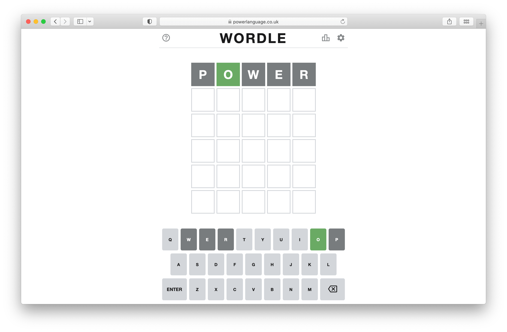
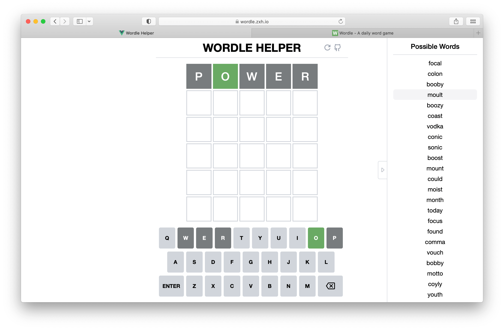
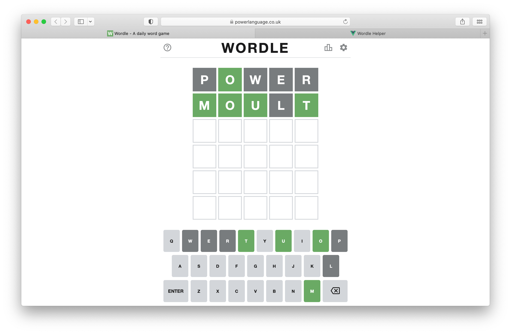
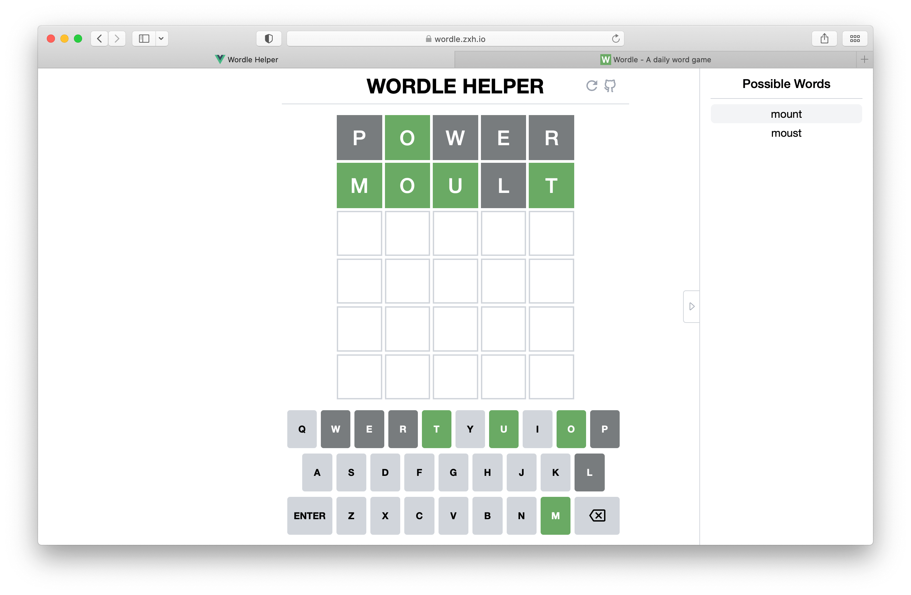
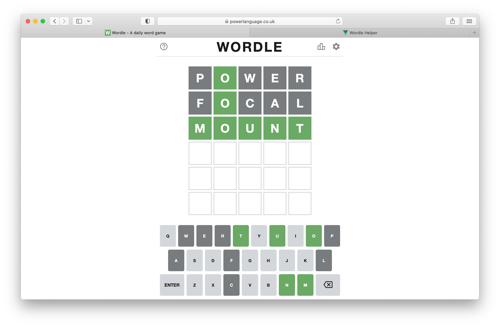

# Wordle Helper

Help you solve [Wordle](https://www.powerlanguage.co.uk/wordle/) puzzles when your vocabulary failes you.

Have fun with it here: [wordle.zxh.io](https://wordle.zxh.io)


&nbsp;

## How to use

First, start a [Wordle](https://www.powerlanguage.co.uk/wordle/) puzzle and guess your first word, for example *POWER*:



Now you get Wordle's feedback. Then, fill *POWER* in our [helper](https://wordle.zxh.io) just like you did in Wordle and **click the tile** to change its state:

- click once: gray (absent)
- twice: yellow (wrong spot)
- three times: green (correct)

After that, all possible words would be listed in the sidebar on the right:



Select one from it and have another try in Wordle:



Then turn to the helper:



Okey, you win:




&nbsp;

## Development

It's powered by [Vue 3](https://v3.vuejs.org/), [Tailwind CSS](https://tailwindcss.com) and [Vite](https://vitejs.dev/).

Clone the repo and install dependencies:

```bash
yarn
```

Start dev server / building:

```bash
yarn dev
yarn build
```


&nbsp;

## License

[MIT](LICENSE)
